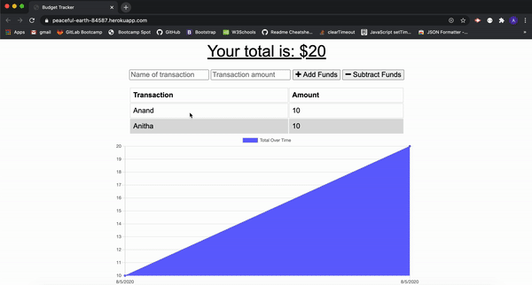

# budget-tracker
### Objective
* A budgeting app to keep track of personal finances utilizes IndexedDB, cache API, and Service Workers to provide an offline experience for the application.
### Description
* The user will be able to add expenses and deposits to their budget with or without a connection. 
* When the user inputs a withdrawal or deposit transactions(deposits,expenses) offline, they should populate the total when brought back online.
* Adding offline entries to the transaction history, it should show on the webpage when connection is back online.
### Installation
* Steps to install the node npm packages

* `npm i`
### Dependencies
* compression
* express
* mongoose
* morgan
* lite-server

Note: They already included in npm package.json

### Usage
* `git clone git@github.com:Anitha-Venkatesan/budget-tracker.git`
* `cd budget-tracker`
* Open budget-tracker folder in Command Line Terminal then run command `npm start`
### Screenshots

### Heroku Deployed URL
[Demo](https://peaceful-earth-84587.herokuapp.com/)
### License
* This program is licensed under the MIT license.

### Questions
If you have any questions, Please feel free to contact me Anitha Venkatesan on my email anithamca68@gmail.com

You can also create [issues](https://github.com/Anitha-Venkatesan/budget-tracker/issues) on my repo.
